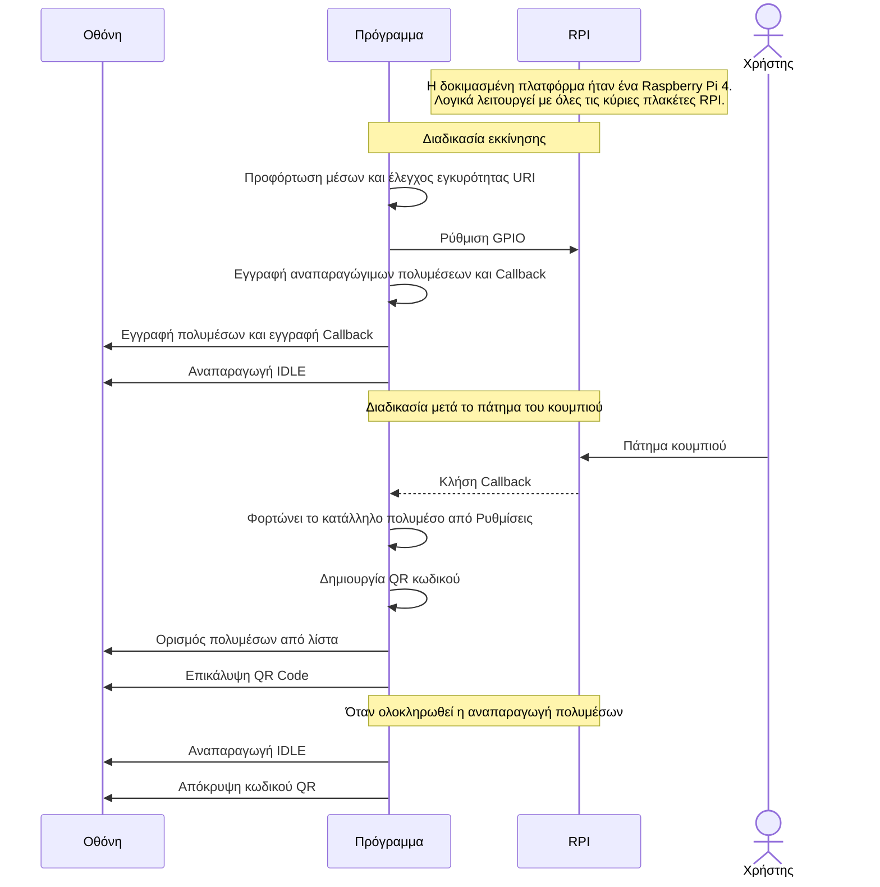

# 4peirlyk PyVLC Player
Το πρόγραμμα πίσω απο τον «3D Εκτυπωμένος Χάρτης για Προσβασιμότητα στην Πολιτιστική Κληρονομιά των Τρικάλων», του Ομίλου «ΙοΤ & Ρομποτική» του 4ου Πειραματικού ΓΕΛ Τρικάλων.
Γραμμένο σε Python, απο τους μαθητές του Ομίλου, για να τρέχει στα Raspberry Pi.

## Οργάνωση του Project

```bash
.
├── config.toml: Ρυθμίσεις Προγράμματος
└── src
    ├── gpio.py: Διαχείριση GPIO 
    ├── gui 
    │   ├── alert.py: Παράθυρο Ειδοποίησης
    │   └── vlc.py: VLC Player
    ├── main.py: Σημείο εισόδου
    ├── qr.py: Δημιουργία QR Code
    └── uri.py: Έλεγχος URI 
```

## Demo


