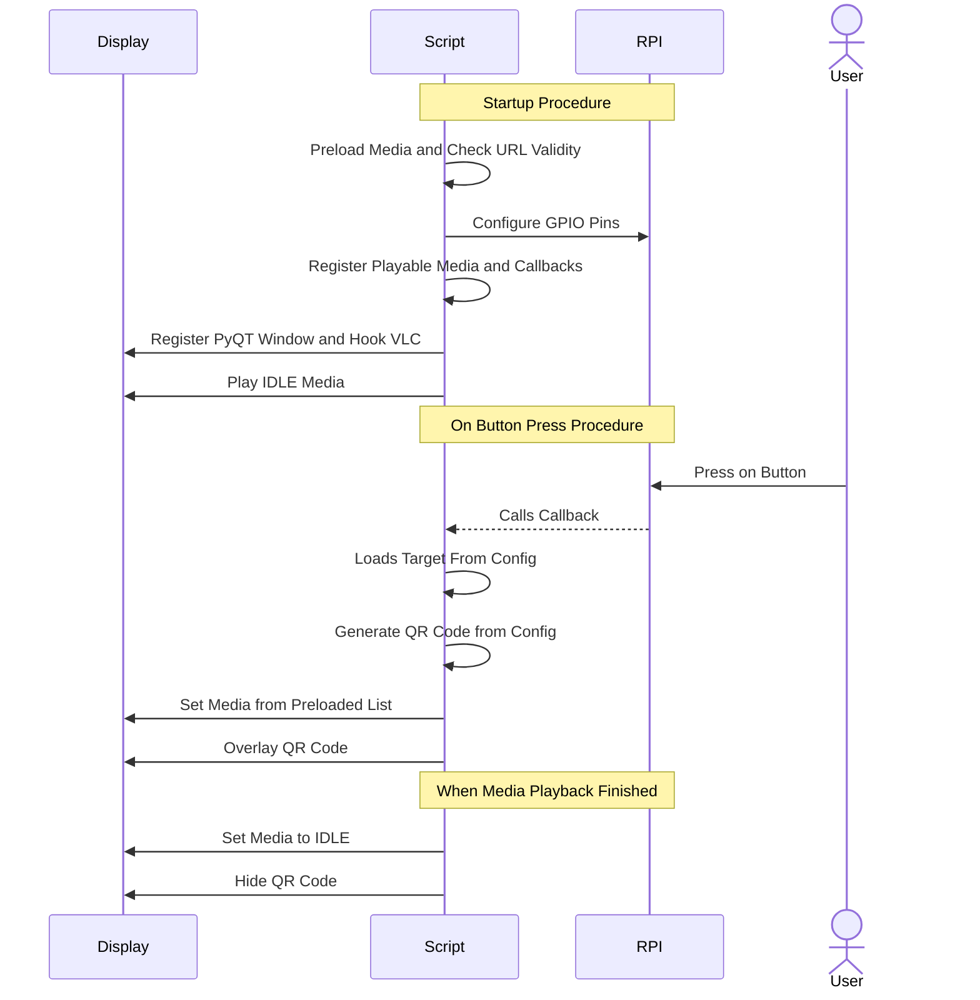

# 4peirlyk PyVLC Player
Το πρόγραμμα πίσω απο τον «3D Εκτυπωμένος Χάρτης για Προσβασιμότητα στην Πολιτιστική Κληρονομιά των Τρικάλων», του Ομίλου «ΙοΤ & Ρομποτική» του 4ου Πειραματικού ΓΕΛ Τρικάλων.
Γραμμένο σε Python, απο τους μαθητές του Ομίλου, για να τρέχει στα Raspberry Pi.

## Οργάνωση του Project

```bash
.
├── config.toml: Player Configuration
├── requirements.txt: Python Project Requirments
└── src: Source File Directory
    ├── gpio.py: GPIO Related Logic
    ├── gui: GUI Widget Directory
    │   ├── alert.py: Alert Popup
    │   └── vlc.py: VLC Player Logic
    ├── main.py: Entrypoint
    ├── qr.py: QR Code Generation Logic
    └── uri.py: URI Validation Logic
```

## Demo


